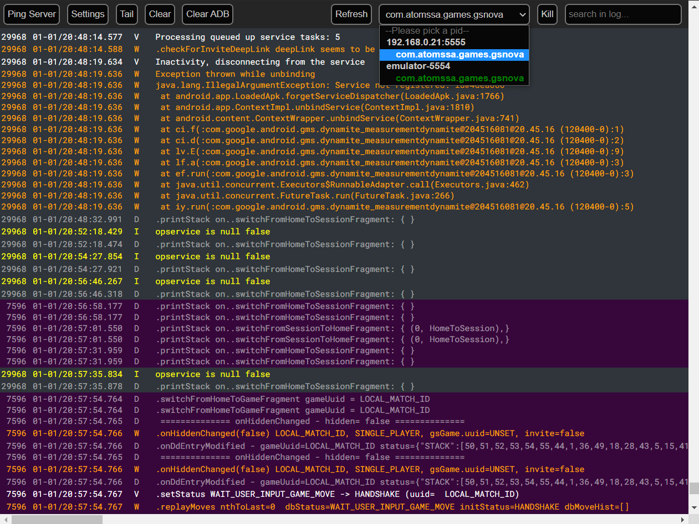

# wadb

Tail adb log from multiple devices simultaneously in the browser. Android studio integrated adb logcat doesn't offer possibility to view output from multiple devices in the same window. This can be helpful when debugging interaction between two installs for multiuser apps like games or chat apps. Tested on windows WSL2.

# Screenshot

Sample screenshot debugging on two devices simultaneously:



The background color allows to distinguish which part of the log comes from which device. Here the purple background is for 192.168.0.21:5555 and the grey background is for emulator-5554. The dropdown menu allows to select which processes to debug.

# backend/

Python websocket server based on SocketIO that connects to adb and handles streaming of logcat output from all connected devices on the developpment machine. After installing the dependencies, run

```shell
python main.py --adb-exe=$PATH_TO_ANDROID_TOOLS_ADB_BINARY
```

from inside the backend/ repository. The path to adb is required argument. This command will start a dev server broadcasting on 127.0.0.1:5000.

# frontend/

react.js app that connects to the backend app on local host and shows log output from selected devices/packages. It offers a gui for some customization of how logcat output is displayed, including regexp selector and column picker.

After starting the backend, change to the frontend/ directory and launch:

```shell
npm install # only on first time launch to download the dependencies
npm start
```

This will open a browser window at localhost:3000, and will listen to 127.0.0.1:5000 to communicate with the backend.

# v0.0.1

This version was tested on python 3.8 env and npm v14.15.3 with the below dependencies using development servers of flask and react.js

## python dependencies

flask, flask_socketio, flask_cors, argparse

## js dependencies

### react

react, react-dom, react-scripts, react-alert, react-modal, react-tabs, react-scroll

### others

socket.io-client, axios, immer, node-sass, uuid, web-vitals

# TODO

- Deployable packages to avoid relying on developpment servers (slow, no hot-reload)
- Backend improvements
  - Synchrnoize timestamp between devices (currently messages are ordered first come first served)
- UI improvements
  - Color picker for background/foreground
  - Clear adb log in browser and on devices
  - ~~Text search functionality~~
  - Option for log message warapping. For now, no wrapping for long lines. they just extend to the right
  - Save settings between sessions (maybe send to backend, write json to file, named sessions...)
  - linkify source file with line numbers in stack traces when file is part of package being debugged
